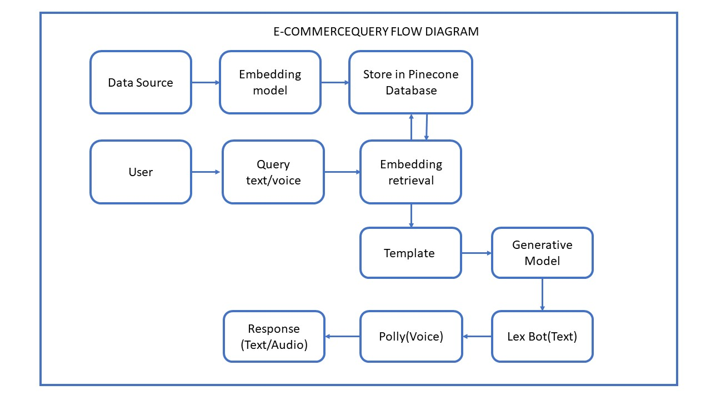

# AWS Lex Conversational FAQ Demo

Demonstration of LLM integration into a lex bot and Polly using Lambda codehooks and a Sagemaker endpoint.
# Project Work Flow 
- Data Source & Embedding: Firstly data converted to embeddings and stored in database.
- Store in Database: The processed query is stored in a Pinecone database.
- User Query: The user makes a query through text or voice.
- Embedding Retrieval: The system retrieves similar data (embedding) from the database.
- Template: Retrived data inserted in template which followed by model for response generation. 
- Response Generation: A generative model is used to generate a response based on the retrieved data.
- Text or Voice Response: The response is delivered to the user in text or voice format.



### What resources will be created?
This CDK code will create the following:
   - 1 Sagemaker endpoint hosting a model (default configuration is TheBloke/Llama-2-13B-GPTQ on ml.g5.2xlarge)
   - 1 Lex bot
   - 1 Lambda functions ( to be invoked as codehook during lambda and provide an FAQ answer when needed)
   - 2 Iam roles (one for the lex bot to call lambda, one for the lambdas to call sagemaker)

## Requirements

### AWS setup
**Region**

If you have not yet run `aws configure` and set a default region, you must do so, or you can also run `export AWS_DEFAULT_REGION=<your-region>` 

**Authorization**

You must use a role that has sufficient permissions to create Iam roles, as well as cloudformation resources

#### Python >=3.7
Make sure you have [python3](https://www.python.org/downloads/) installed at a version >=3.7.x

#### Docker
Make sure you have [Docker](https://www.docker.com/products/docker-desktop/) installed on your machine and running in the background 

#### AWS CDK
Make sure you have the [AWS CDK](https://docs.aws.amazon.com/cdk/v2/guide/getting_started.html#getting_started_install) installed on your machine


## Setup

### Set up virtual enviroment and gather packages

```
cd ai-ecommerce-query-text-audio
```

Install the required dependencies (aws-cdk-lib and constructs) into your Python environment 
```
pip install -r requirements.txt
```

### Gather and deploy resources with the CDK

First synthesize, which executes the application, defines which resources will be created, and translates this into a cloudformation template
```
cdk synth
```
Now bootstrap, which provisions the resources you'll use when deploying the application
```
cdk bootstrap
```
and deploy with
```
cdk deploy LexGenAIDemoFilesStack
```

The deployment will create a lex bot  and will dockerize the code in the  `lex-gen-ai-demo-docker-image` directory and push that image to ECR so it can run in Lambda. Don't worry if this step takes a long time while pushing to ECR, we are bundling up two docker images and uploading them so it will take some time.
### Uploading file on Pinecone database. 
First You have to make the embedding of Pdf and upload it on Pinecone from where it can be extracted using lambada function for the response generation.
## Usage
Note, the first time the embedding lambda and the runtime lambda are called the latency will be much slower as it must load resources and save them in the lambda enviroment. Once loaded these resources will stay in the enviroment as long as the ECR image is not deleted. This means your first request will be slow but after that it will be faster now that the resources are cached.


```


### Configurations

🚨 **Remember to shut down your endpoint if you're done using it!** 🚨

We have provided a script to deactivate an endpoint and endpoint configuration with whatever name is in the endpoint creation script. To run:
```
python3 shut_down_endpoint.py


#### Custom model and instance type configuration:

The function `create_endpoint_from_HF_image()` is called in `app.py`. This function accepts the following arguments:
 - hf_model_id (required): For the our project we have this set to [TheBloke/Llama-2-13B-GPTQ](https://huggingface.co/TheBloke/Llama-2-13B-GPTQ). You can find any model on https://huggingface.co/ and feed it in
 - instance_type (optional, default is ml.g5.2xlarge): If you don't give an argument we'll use ml.g5.2xlarge. You can use any endpoint [sage instance type](https://aws.amazon.com/sagemaker/pricing/)
 - endpoint_name (optional, default is whatever SAGEMAKER_ENDPOINT_NAME is set to in the file endpoint_handler.py): You can give your endpoint a custom name. It is recomended that you don't do this but if you do, you have to change it in the lamdba images (constant is called ENDPOINT_NAME in index_creation_app.py and runtime_lambda_app.py)
 - number_of_gpu (optional, default is 1): Set this to any number of GPUs the hardware you chose allows. 

 If you have in invalid configuration the endpoint will fail to create. You can see the specific error in the cloudwatch logs. If you fail creation you can run `python3 shut_down_endpoint.py` to clean up the endpoint but if you do so manually in the console **you must delete both the endpoint and the endpoint configuration**

#### Further configuration
If you would like to further configure the endpoint you can change the specific code in `endpoint_handler.py`

The LLM is hosted on a sagemaker endpoint and deployed as a sagemaker [ceModel](https://sagemaker.readthedocs.io/en/stable/frameworks/ce/sagemaker.ce.html). We are also using a ce model image. You can read more about it [here](https://aws.amazon.com/blogs/machine-learning/announcing-the-launch-of-new-hugging-face-llm-inference-containers-on-amazon-sagemaker/). For further model configuration you can read about sagemaker model deployments [here](https://docs.aws.amazon.com/sagemaker/latest/dg/realtime-endpoints-deployment.html).


### Tips for best results

**Keep your lambda perpetually warm by provisioning an instance for the runtime lambda (lex-codehook-fn)**

Go to Lambda console > select the function lex-codehook-fn

Versions > Publish new version

Under this version 
   - Provisioned Concurrency > set value to 1
   - Permissions > Resource based policy statements > Add Permissions > AWS Service > Other, your-policy-name, lexv2.amazonaws.com, your-lex-bot-arn, lamdba:InvokeFunction

Go to your Lex Bot (LexGenAIDemoBotCfn)

Aliases > your-alias > your-language > change lambda function version or alias > change to your-version

This will keep an instance running at all times and keep your lambda ready so that you won't have cold start latency. This will cost a bit extra (https://aws.amazon.com/lambda/pricing/) so use thoughtfully. 
